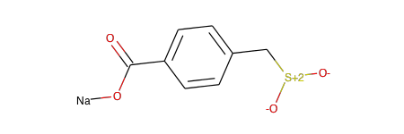
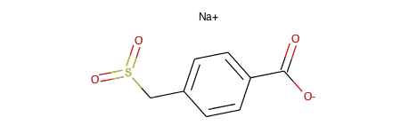

.. _standardize:

Standardization
===============

.. sectionauthor:: Matt Swain <m.swain@me.com>

This page gives details on the standardization process.

Standardizing a molecule
------------------------

The ``standardize_smiles`` function provides a quick and easy way to get the standardized version of a given SMILES
string::

    >>> from molvs import standardize_smiles
    >>> standardize_smiles('C[n+]1c([N-](C))cccc1')
    'CN=c1ccccn1C'

While this is convenient for one-off cases, it's inefficient when dealing with multiple molecules and doesn't allow any
customization of the standardization process.

The ``Standardizer`` class provides flexibility to specify custom standardization stages and efficiently standardize
multiple molecules::

    >>> from rdkit import Chem
    >>> mol = Chem.MolFromSmiles('[Na]OC(=O)c1ccc(C[S+2]([O-])([O-]))cc1')

::

    >>> from molvs import Standardizer
    >>> s = Standardizer()
    >>> smol = s.standardize(mol)

The standardization process
---------------------------

TODO: Explain this properly...

RDKit Sanitize
~~~~~~~~~~~~~~

- Nitro N=O: ``CN(=O)=O >> C[N+](=O)[O-]`` and ``C1=CC=CN(=O)=C1 >> C1=CC=C[N+]([O-])=C1``
- Nitro N#O: ``C-N=N#N >> C-N=[N+]=[N-]``
- Perchlorate: ``Cl(=O)(=O)(=O)[O-] >> [Cl+3]([O-])([O-])([O-])[O-]``
- Calculate explicit and implicit valence of all atoms. Fails when atoms have illegal valence.
- Calculate symmetrized SSSR. Slowest step, fails in rare cases.
- Kekulize.  Fails if a Kekule form cannot be found or non-ring bonds are marked as aromatic.
- Assign radicals if hydrogens set and bonds+hydrogens+charge < valence.
- Set aromaticity, if none set in input. Go round rings, Huckel rule to set atoms+bonds as aromatic.
- Set conjugated property on bonds where applicable.
- Set hybridisation property on atoms.
- Remove chirality markers from sp and sp2 hybridised centers.

RDKit RemoveHs
~~~~~~~~~~~~~~

- RDKit implementation detail - this is the preferred way to store the molecule.
- Remove explicit H count from atoms, instead infer it on the fly from valence model.

Disconnect metals
~~~~~~~~~~~~~~~~~

- Break covalent bonds between metals and organic atoms under certain conditions.
- First, disconnect N, O, F from any metal. Then disconnect other non-metals from transition metals (with exceptions).
- For every bond broken, adjust the charges of the begin and end atoms accordingly.
- In future, we might attempt to replace with zero-order bonds.

Apply normalization rules
~~~~~~~~~~~~~~~~~~~~~~~~~

- A series of transformations to correct common drawing errors and standardize functional groups. Includes:
- Uncharge-separate sulfones
- Charge-separate nitro groups
- Charge-separate pyridine oxide
- Charge-separate azide
- Charge-separate diazo and azo groups
- Charge-separate sulfoxides
- Hydrazine-diazonium system

Reionize acids
~~~~~~~~~~~~~~

If molecule with multiple acid groups is partially ionized, ensure strongest acids ionize
first.

The algorithm works as follows:

- Use SMARTS to find the strongest protonated acid and the weakest ionized acid.
- If the ionized acid is weaker than the protonated acid, swap proton and repeat.

Recalculate stereochemistry
~~~~~~~~~~~~~~~~~~~~~~~~~~~

- Use built-in RDKit functionality to force a clean recalculation of stereochemistry
